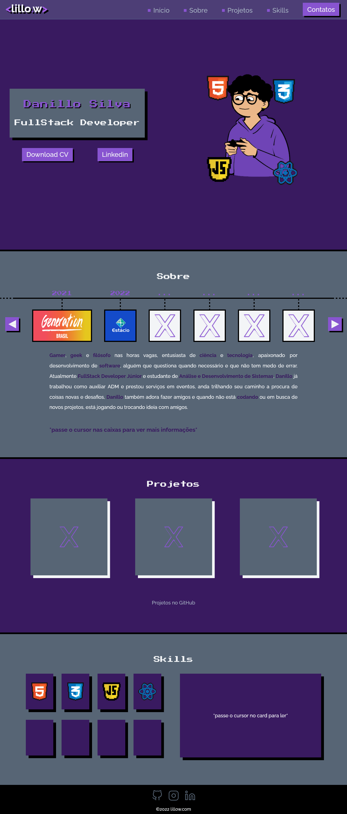

<h1 align="center">
  💻 Meu Portfólio
</h1>

<h4 align="center">
  Portfólio criado com o intuito de mostrar meus projetos e outras informações.
</h4>

<h4 align="center"><a href="https://lillow.github.io/portfolio/">Clique para visitar o projeto</a></h4>

## 📚 Seções

O site é composto por 5 seções diferentes:

-   **Home:** Breve apresentação;
-   **Sobre:** Descrição falando um pouco sobre mim;
-   **Projetos:** Apresenta alguns projetos desenvolvidos e com link direto para os respectivos códigos no GitHub;
-   **Serviços:** Exibe através de cards as diferentes experiências educacionais e profissionais que possuo;
-   **Conhecimentos:** Nele apresentamos meus conhecimentos em algumas linguagens e tecnologias;

---

## 💼 Tecnologias utilizadas

Para o desenvolvimento deste site utilizei as seguintes tecnologias:

-   HTML;
-   JavaScript;
-   Css;

---

## Autor 

<table>
  <tr>
    <td align="center">
      <a href="https://github.com/lillow">
         
        
          <b>Danillo Silva</b>
        
      </a>
    </td>
  </tr>
</table>
